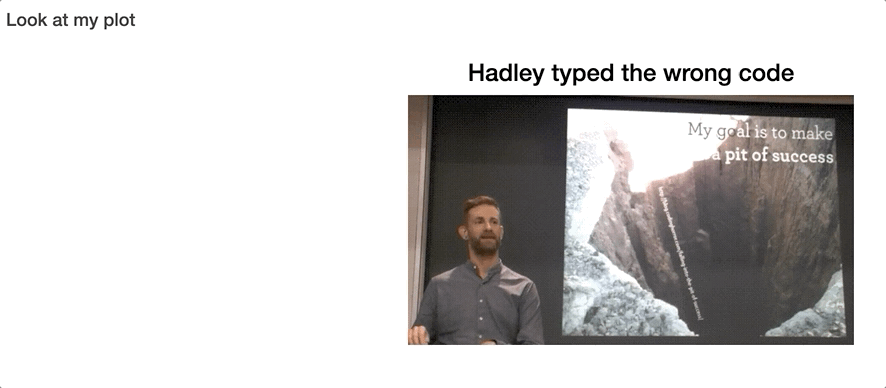

# Cleave

Cleave will let you customise your Shiny error messages.

## Basics

Include `use_sever` in your UI then use `cleave` in the server. The `cleave` function takes several arguments to customise your errors, by default it forwards the error message, only centering it in the middle of the element, which you can turn off by setting `center_vertical` and `center_horizontal` to `FALSE`.

```r
library(shiny)
library(sever)

ui <- fluidPage(
  use_sever(),
  fluidRow(
    column(4, uiOutput("thing", width = "100%")),
    column(8, plotOutput("plot"))
  )
)

server <- function(input, output){
  cleave()

  # will generate errors
  output$thing <- renderUI({
    p(error)
  })

  output$plot <- renderPlot({
    plot(error)
  })
}

shinyApp(ui, server)
```

By default not much changes.


## Single Message

The first element of the `cleave` function lets you specify a different error message. You can also customise the text and background color.

```r
library(shiny)
library(sever)

ui <- fluidPage(
  use_sever(),
  fluidRow(
    column(4, uiOutput("thing", width = "100%")),
    column(8, plotOutput("plot"))
  )
)

server <- function(input, output){
  cleave(
    html = p("Sorry!"),
    color = "white",
    bg_color = "#333e48"
  )

  # will generate errors
  output$thing <- renderUI({
    p(error)
  })

  output$plot <- renderPlot({
    plot(error)
  })
}

shinyApp(ui, server)
```


## Multiple Messages

You can also specify a list of ids of elements to which the `cleave` should apply, then of course you can use multiple `cleave` in a single app.

```r
library(shiny)
library(sever)

ui <- fluidPage(
  use_sever(),
  fluidRow(
    column(4, uiOutput("thing", width = "100%")),
    column(8, plotOutput("plot"))
  )
)

server <- function(input, output){
  cleave("ehhh", ids = "thing")
  cleave(h2("You broke this!"), ids = "plot")

  # will generate errors
  output$thing <- renderUI({
    p(error)
  })

  output$plot <- renderPlot({
    plot(error)
  })
}

shinyApp(ui, server)
```


## Theme

You can set a theme for all your `cleave` to avoid repeating arguments and ensure all errors have a consistent look. This can be done inside or outside the server function. Notice the `duration` argument to change the duration of the animation, set to 0 to have none.

```r
library(shiny)
library(sever)

# define theme
cleave_theme(color = "white", bg_color = "black", duration = 1)

ui <- fluidPage(
  use_sever(),
  fluidRow(
    column(4, uiOutput("thing", width = "100%")),
    column(8, plotOutput("plot"))
  )
)

server <- function(input, output){
  cleave("ehhh", ids = "thing")
  cleave(h2("You broke this!"), ids = "plot")

  # will generate errors
  output$thing <- renderUI({
    p(error)
  })

  output$plot <- renderPlot({
    plot(error)
  })
}

shinyApp(ui, server)
```


## Be Creative

The cleave function accepts any valid html, be creative.

```r
library(shiny)
library(sever)

cl <- tagList(
  h3("Hadley typed the wrong code"),
  tags$img(src="https://i.imgur.com/7J1bEaJ.gif", height="250px")
)

ui <- fluidPage(
  use_sever(),
  h4("Look at my plot"),
  plotOutput("plot")
)

server <- function(input, output){
  cleave(cl, color = "black", center_vertical = FALSE)

  # will generate an error
  output$plot <- renderPlot({
    plot(error)
  })
}

shinyApp(ui, server)
```



