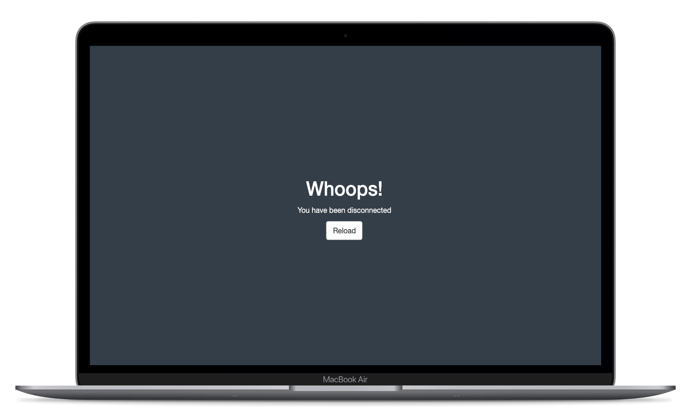
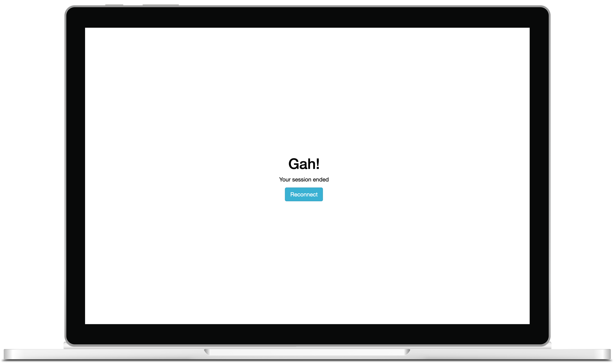
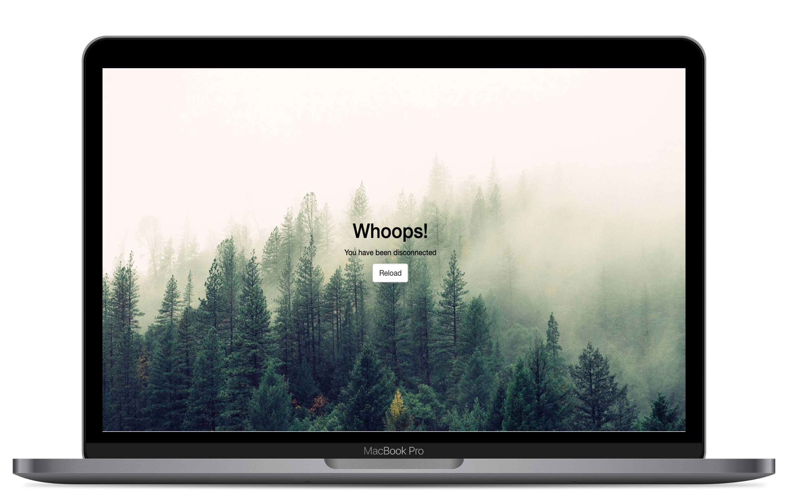

# Sever

Sever will let you customise the Shiny disconnected screen.

## Basics

Include dependencies with `use_sever` then use the `sever` function to customise the screen, launch the app and stop the server to see the customised screen.

``` r
library(shiny)
library(sever)

ui <- fluidPage(
  use_sever(),
  h1("sever")
)

server <- function(input, output){
  sever()
}

shinyApp(ui, server)
```



## Customise

The first argument of the `sever`function (`html`) is used to specify the html to be displayed on the disconnected screen and defaults to `sever_default`; you can of course change that behaviour. You can customise the default to some extend.

``` r
library(shiny)
library(sever)

disconnected <- sever_default(
  title = "Gah!", 
  subtitle = "Your session ended", 
  button = "Reconnect", 
  button_class = "info"
)

ui <- fluidPage(
  use_sever(),
  h1("sever")
)

server <- function(input, output){
  sever(html = disconnected, bg_color = "white", color = "black")
}

shinyApp(ui, server)
```



``` r
library(shiny)
library(sever)

disconnected <- tagList(
  h1("Whoah there..."),
  p("Something went terribly wrong!"),
  reload_button("REFRESH", class = "warning")
)

ui <- fluidPage(
  use_sever(),
  h1("sever")
)

server <- function(input, output){
  sever(html = disconnected, bg_color = "#000")
}

shinyApp(ui, server)
```


If you want to even further customise the screen with CSS; it is assigned the `severed` CSS class.

## Background Image

You can also use a background image.

``` r
library(shiny)
library(sever)

img <- paste0(
  "https://images.pexels.com/photos/4827/",
  "nature-forest-trees-fog.jpeg?auto=compress",
  "&cs=tinysrgb&dpr=2&h=750&w=1260"
)

ui <- fluidPage(
  use_sever(),
  h1("sever")
)

server <- function(input, output){
  sever(bg_image = img, color = "black")
}

shinyApp(ui, server)
```


